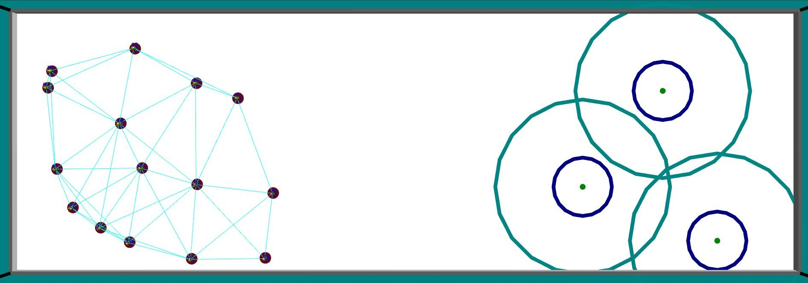

# Demonstration Code for RA-L (ICRA 2026) Paper:

**A Blockchain Framework for Equitable and Secure Task Allocation in Robot Swarms**

**Authors:** Hanqing Zhao, Alexandre Pacheco,  Giovanni Beltrame, Xue Liu,  Marco Dorigo and Gregory Dudek

**Maintained by:** Hanqing Zhao (hq.zhao@mail.mcgill.ca)

---

## Acknowledgments

This implementation builds on the following prior works:

- **Alexandre Pacheco** for the ARGoS-Blockchain Interface in Python  
  [https://github.com/teksander/toychain-argos](https://github.com/teksander/toychain-argos)

- **Ken Hasselmann** for the ARGoS-Python wrapper  
  [https://github.com/KenN7/argos-python](https://github.com/KenN7/argos-python)

- **Ulysse Denis** for implementing a pure Python blockchain with smart contract support (toychain)  
  [https://github.com/uldenis/PROJH402](https://github.com/uldenis/PROJH402)

**Note:** The modules from these projects have been modified. Please follow the instructions below for deployment.

---

## Overview

The demonstration code consists of four main components:

- **argos-python** — ARGoS–Python wrapper  
- **argos3-epuck** — ePuck robot plugin for ARGoS  
- **toychain** — Python-based blockchain implementation.  
  - The smart contract, task tree, and reward model are implemented in `toychain/src/Block.py`.  
- **slam2dga** — Main experiment directory.  
  - Robot controllers are implemented in `slam2dga/controllers/`.  

## Installation

### 1. Install ARGoS Simulator

```bash
sudo apt-get install git build-essential cmake g++ libfreeimage-dev \
libfreeimageplus-dev qt5-default freeglut3-dev libxi-dev libxmu-dev \
liblua5.3-dev lua5.3 doxygen graphviz graphviz-dev asciidoc

git clone https://github.com/ilpincy/argos3.git
cd argos3
mkdir build
cd build
cmake ../src
make -j4
make doc
sudo make install
sudo ldconfig
```

### 2. Clone This Repository
#### 2.1 Install ePuck Plugin

```bash
cd argos3-epuck/
mkdir build
cd build
cmake ../src
make
sudo make install
sudo ldconfig
```

#### 2.2 Install ARGoS-Python
```bash
cd argos-python/
mkdir build
cd build
cmake ..
make
```

#### 2.3 Install Runtime Dependencies
```bash
pip3 install aenum hexbytes sympy dill
```
Then, update line 2 in `experimentconfigure.sh` to point to your local project path.

## Experiment Configurations
Experiment configurations can be adjusted in `experimentconfig.sh` and overridden in `run-experiment`

The table below explains selected key configuration parameters:

| **Parameter**      | **Description**                                                                                                             | **Values / Notes**                                                                                                                                                                                                                                       |
| ------------------ |-----------------------------------------------------------------------------------------------------------------------------|----------------------------------------------------------------------------------------------------------------------------------------------------------------------------------------------------------------------------------------------------------|
| `NUM1`             | Number of **low drift robots**                                                                                              | Integer                                                                                                                                                                                                                                                  |
| `NUM3`             | Number of **high drift robots**                                                                                             | Integer                                                                                                                                                                                                                                                  |
| `NUMM`             | Number of **malicious robots**                                                                                              | Integer                                                                                                                                                                                                                                                  |
| `NUMLANDMARKS`     | Number of **landmarks** in the arena                                                                                        | Integer                                                                                                                                                                                                                                                  |
| `MAXCLUSTERS`      | Maximum number of **open landmark clusters** awaiting verification allowed on the smart contract                            | Integer                                                                                                                                                                                                                                                  |
| `MAXNEGCLUSTERS`   | Maximum number of **free space clusters** that do not require verification allowed on the smart contract                    | Integer                                                                                                                                                                                                                                                  |
| `SAVECONFIRMATION` | Whether to save verified landmark positions into the consensus set                                                          | `1`: Save, stop experiment once all landmarks are sufficiently verified and added to the consensus set<br>`0`: Discard confirmed landmark, allowing robots to continue discovery and verification landmarks, for studying Q-value distribution evolution |
| `LOADEAPARAMS`     | Whether to load Q-values for task selection from a previous experiment (an example data is provided in `/slam2dga/results`) | `1`: Load Q-values (requires editing line 170 in `slam2dga/controller/main_collab.py`)<br>`0`: Do not load Q-values                                                                                                                                      |
| `RABRANGE`         | Communication range of neighboring robots in arena size units (arena size = 4.5 × 13.4 units)                               | Float                                                                                                                                                                                                                                                    |


## Running an Experiment
```
cd slam2dga
./run-experiment
```
This will launch the simulation, and the arena will appear on your screen:
